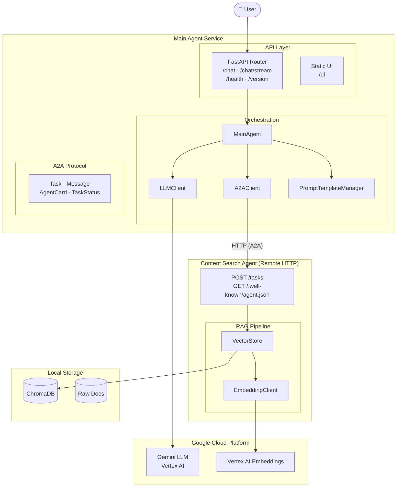

# A2A Content Assistant

A production-grade **multi-agent RAG system** using Google's A2A (Agent-to-Agent) protocol.
Search agent retrieves relevant content from in-house documents using Vertex AI embeddings + ChromaDB.
Main agent synthesizes answers using Gemini Flash.

## Architecture



## Quick Start

```bash
git clone https://github.com/DeepeshKashyup/a2a-ai-assistant
cd a2a-ai-assistant
pip install -r requirements.txt
cp .env.example .env
# Edit .env — set GCP_PROJECT_ID
```

**1. Ingest and embed your documents**

Add `.txt`, `.pdf`, `.md`, or `.docx` files to `data/raw/`, then run:

```bash
make ingest   # chunk documents → data/processed/
make seed     # embed chunks → ChromaDB (data/embeddings/)
```

**2. Start the Content Search Agent** (port 8081)

```bash
uvicorn search_agent_app.main:app --host 0.0.0.0 --port 8081 --reload
```

**3. Start the Main Agent** (port 8080)

```bash
python -m app.main
```

**4. Open the UI**

```
http://localhost:8080/ui
```

- **Chat** — direct LLM, no retrieval
- **Stream** — streaming chat via SSE
- **Query (RAG)** — A2A → Search Agent → Gemini, with source citations

**5. Or hit the API directly**

```bash
curl -X POST http://localhost:8080/api/v1/query \
  -H "Content-Type: application/json" \
  -d '{"question": "your question here", "top_k": 5}'
```

```bash
make test
```

## Tech Stack

| Component | Technology |
|-----------|-----------|
| API Framework | FastAPI + Uvicorn |
| LLM | Gemini 1.5 Flash (Vertex AI) |
| Embeddings | text-embedding-004 (Vertex AI) |
| Vector Store | ChromaDB |
| Agent Protocol | Google A2A |
| Config | Pydantic Settings |
| Logging | Structlog |
| Testing | Pytest + pytest-asyncio |
| Container | Docker + Compose |

## Project Structure

```
a2a-content-assistant/
├── app/                    # Main Agent FastAPI app
│   ├── main.py             # Entry point (port 8000)
│   ├── api/routes.py       # /health, /chat, /query
│   ├── core/               # Config + logging
│   └── middleware/         # Error handling (Day 6)
├── search_agent_app/       # Content Search Agent (port 8001)
│   ├── main.py             # A2A server entry
│   └── routes.py           # /.well-known/agent.json, /tasks
├── src/
│   ├── a2a/                # A2A protocol schemas + client
│   ├── agents/             # Main agent + search agent logic
│   ├── chains/             # In-process RAG pipeline
│   ├── retrieval/          # Chunking, embeddings, ChromaDB
│   ├── prompts/            # Prompt template manager
│   ├── tools/              # LangChain tools
│   ├── guardrails/         # Input/output safety (Day 6)
│   └── utils/              # LLM client, helpers
├── scripts/                # ingest.py, seed_vectorstore.py
├── eval/                   # Metrics, test cases, eval runner
├── tests/                  # pytest test suite
├── configs/                # config.yaml, prompts.yaml
├── docker/                 # Dockerfile, docker-compose.yaml
└── notebooks/              # Exploration + evaluation notebooks
```

[](https://github.com/DeepeshKashyup/a2a-ai-assistant/actions/workflows/ci.yml)
